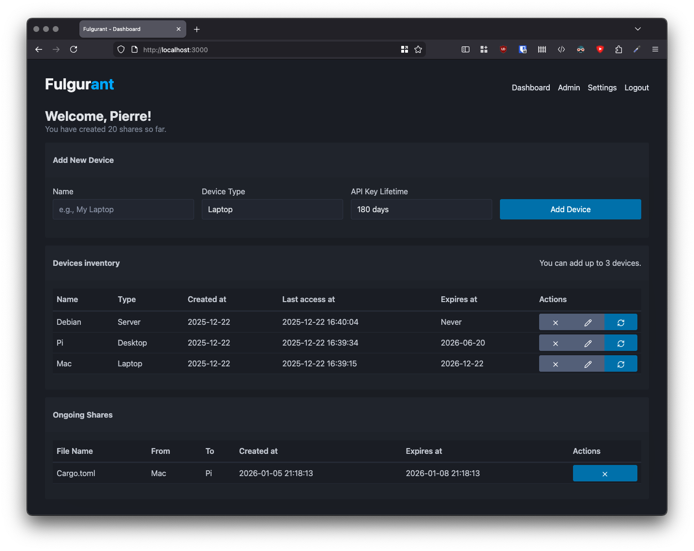
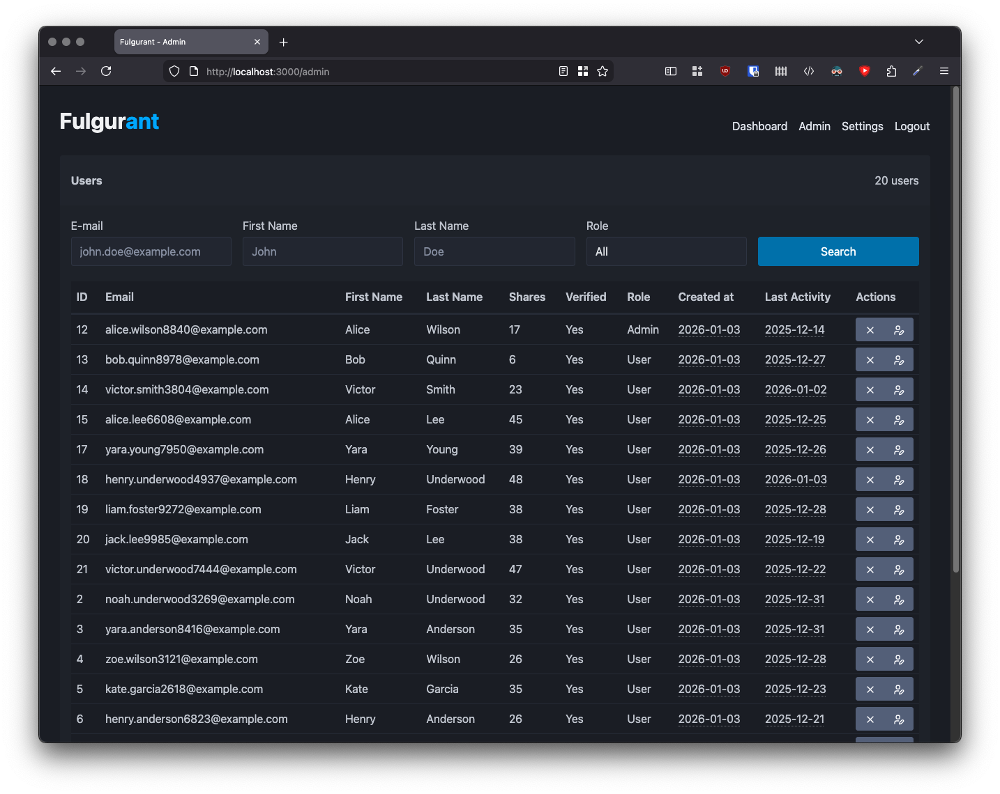

# Fulgurant

Backend API server for [Fulgur](https://github.com/fulgur-app/fulgur), a multiplatform text editor. Enables file synchronization between devices with end-to-end encryption. Self-hostable to keep user data private.

Despite already having all the needed features to be perfectly effective together with Fulgur, **this server is still in active development and is not yet recommended for production.** There's still some work to be done (which may imply breaking changes), and more testing, for Fulgurant to be given the green light for production with a direct, public access. If you want to test Fulgurant, please run it in a private environment not facing the wild internet yet.

The main dashboard (for all users): allows to manage the user's devices and ongoing shares, refresh the API keys' validity.



The Admin dashboard (for Admin users only): allows to manage the users (edit the role, deletion).



## Features

- User authentication with email verification
- Device management and API key generation
- End-to-end encrypted file sharing (AES-256-GCM)
- Automatic share expiration and cleanup
- Admin and User type accounts
- Web interface for profile, shares and device management
- Web interface for Admin users for user management
- SQLite database
- HTTPS support
- REST API for desktop app integration
- SSE support for notifying a Fulgur instance of available shares

## In the backlog

* Proper packaging
* PostgreSQL support
* More polished Admin interface (accounts creation/edition,...)
* Docker image

## Requirements

- Rust 1.90 or later

## Build and Run

Build the project:

```bash
cargo build --release
```

Run the server:

```bash
cargo run
```

The server starts by default on `http://127.0.0.1:3000` (see *Optional settings* to change this behaviour)

Run tests:

```bash
cargo test
```

## Configuration

Create a `.env` file in the project root with the following settings:

### Required Settings

```env
# Database location
DATABASE_URL=sqlite:./data/fulgurant.db
```

### Optional Settings

```env
# Environment mode (enables email sending in production, default: true)
IS_PROD=false

# Enable user registration (default: false for security)
CAN_REGISTER=false

# Share expiration (default: 3 days)
SHARE_VALIDITY_DAYS=3

# Maximum devices per user (default: unlimited)
MAX_DEVICES_PER_USER=10

# SSE Heartbeat in seconds (default: 30 seconds)
SSE_HEARTBEAT_SECONDS=30

# Logging
RUST_LOG=Fulgurant=debug,tower_http=debug,sqlx=info
LOG_FOLDER=logs

# Network configuration
BIND_HOST=127.0.0.1  # Use 0.0.0.0 to accept connections from any interface (production)
BIND_PORT=3000       # Port to listen on

# TLS/HTTPS configuration - server runs HTTP if not configured
TLS_CERT_PATH=certs/cert.pem 
TLS_KEY_PATH=certs/key.pem
```

### Email Settings (Required when IS_PROD=true)

```env
SMTP_HOST=smtp.example.com
SMTP_PORT=587
SMTP_USERNAME=your-email@example.com
SMTP_PASSWORD=your-password
SMTP_FROM=noreply@example.com
```

## Running with Docker
### Steps
1. **Download docker-compose.yml** 

2. **Edit docker-compose.yml** with your configuration:
   ```yaml
   environment:
     - SMTP_HOST=your-smtp-server.com
     - SMTP_LOGIN=your-email@example.com
     - SMTP_PASSWORD=your-password
     - CAN_REGISTER=false  # Set to true to allow user registration
   ```

3. **Create the data directory**:
   ```bash
   mkdir -p data
   ```

4. **Start the container**:
   ```bash
   docker-compose up -d
   ```

5. **Create the first admin user**:
   - Navigate to `http://localhost:3000/setup`
   - Follow the setup wizard

6. **View logs**:
   ```bash
   docker-compose logs -f fulgurant
   ```

### Configuration
#### Required Variables

| Variable | Description | Example |
|----------|-------------|---------|
| `SMTP_HOST` | SMTP server hostname | `smtp.mail.ovh.net` |
| `SMTP_PORT` | SMTP server port | `587` |
| `SMTP_LOGIN` | SMTP username | `mail@example.com` |
| `SMTP_PASSWORD` | SMTP password | `your_password` |

#### Optional Variables

| Variable | Default | Description |
|----------|---------|-------------|
| `DATABASE_URL` | `sqlite:/data/fulgurant.db` | SQLite database path |
| `BIND_HOST` | `0.0.0.0` | Bind address (0.0.0.0 for all interfaces) |
| `BIND_PORT` | `3000` | Port to listen on |
| `IS_PROD` | `true` | Production mode (true/false) |
| `CAN_REGISTER` | `false` | Allow user registration |
| `MAX_DEVICES_PER_USER` | `10` | Maximum devices per user |
| `SHARE_VALIDITY_DAYS` | `3` | Days until shares expire |
| `SSE_HEARTBEAT_SECONDS` | `30` | SSE keep-alive interval |
| `RUST_LOG` | `info` | Log level (trace, debug, info, warn, error) |
| `LOG_FOLDER` | `/data/logs` | Log file directory |
| `PUID` | `1000` | User ID for file permissions |
| `PGID` | `1000` | Group ID for file permissions |

## Database Migrations

Migrations run automatically on server startup. Migration files are in `data/migrations/`.

## Background Tasks

The server runs two background tasks:

- **Share cleanup**: Runs every hour, removes expired shares
- **Verification code cleanup**: Runs every minute, removes expired verification codes

## Development vs Production

**Development mode** (`IS_PROD=false`):

- Verification codes printed to console instead of emailed
- Useful for testing without SMTP configuration

**Production mode** (`IS_PROD=true`):

- Emails sent via SMTP (requires email settings)
- HTTPS-only session cookies

## License

Licensed under the Apache License, Version 2.0 (the "License");
you may not use this file except in compliance with the License.
You may obtain a copy of the License at

[http://www.apache.org/licenses/LICENSE-2.0](https://http://www.apache.org/licenses/LICENSE-2.0)

Unless required by applicable law or agreed to in writing, software
distributed under the License is distributed on an "AS IS" BASIS,
WITHOUT WARRANTIES OR CONDITIONS OF ANY KIND, either express or implied.
See the License for the specific language governing permissions and
limitations under the License.
